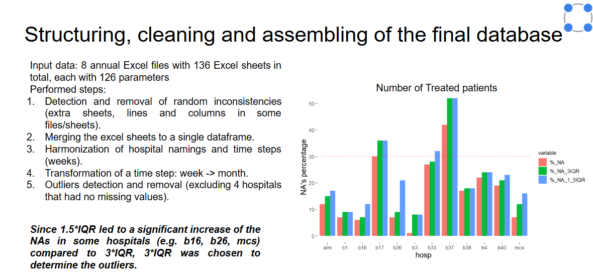
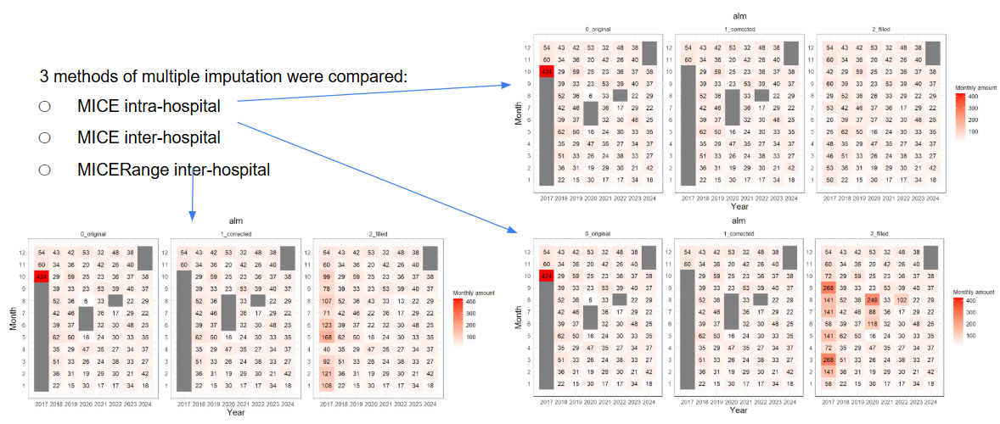
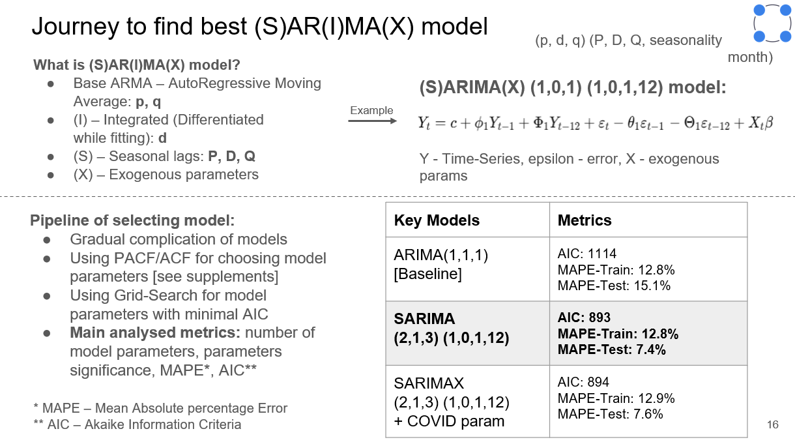
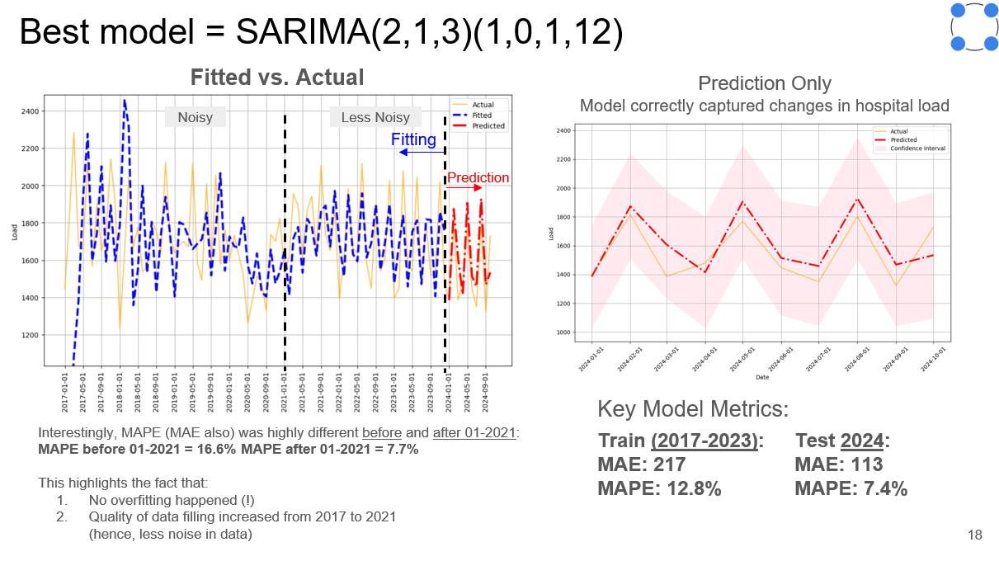

# Forecasting the workload of stroke centers and achieving key quality indicators of stroke care in St. Petersburg based on historical data

## Background

**Motivation:** Acute stroke is one of the leading causes of death. Stroke is the predominant cause of disability in the Russian Federation (3.2 per 1000 population). In RF, according to the results of the 2006 Helsingfors Conference, the two-level model of emergency and specialized medical care for patients with acute stroke was created. Its improvement, which is a driving force of the reorganization and modernization of hospitals receiving stroke patients, requires permanent monitoring with further analysis and forecasting of key indicators and parameters.
 
 
**Aim:** To explore trends and reveal patterns in the provided data and, if patterns are identified, try to predict 
a) the workload of hospitals in the periods of interest within a calendar year; 
b) predict the achievement of KPIs of the Russian Ministry of Health.
 
 
**Objectives:**
1. Compile a structured database from the provided separate files of weekly monitoring.
2. Study missing data and perform imputation.
3. Explore and visualize the trends for key indicators.
4. Build and assess forecasting models for workload metrics.

Study design: Observational cohort study - STROBE guideline

## Data

 

## Shiny app for trend analysis

## Forecasting 

 

## Conclusions

- Data analysis revealed a strong impact of external shocks (as demonstrated by COVID-19 period) on the healthcare system performance in St. Petersburg. 

- Overall, vascular centers in St. Petersburg struggle to meet the MOH targets for the KPIs, but the trends are positive.

- Predictive ability of historical data seems moderate in terms of predicting exact figures, but clearly fits the overall trends.

- The SARIMAX model for predicting summarized hospital load in St. Petersburg achieved an 8% error, demonstrating strong predictive performance while capturing seasonal and trend patterns.

 
 
Authours: Anna Andreychenko, Anrew Kravets, Victoria Zaitceva
 
Supervisors: Tatiana Charitonova, Oleg Arnaut